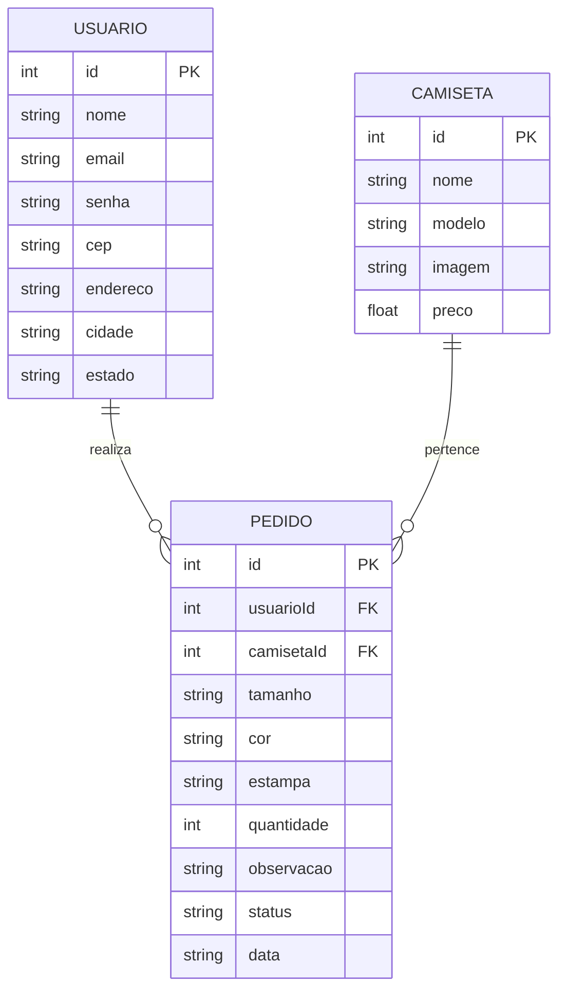

# 🛠️ Especificação Técnica (Tech Spec) — PrintaAI

Este documento descreve a arquitetura técnica, o modelo de dados e os contratos da API simulada pelo JSON Server necessários para o funcionamento da aplicação **PrintaAI**, um sistema web de pedidos de camisetas personalizadas.

---

## 1. Arquitetura Geral

A aplicação será desenvolvida utilizando múltiplas páginas HTML, JavaScript para manipulação dinâmica dos dados e JSON Server como API Fake para armazenamento das informações.

### Tecnologias

* HTML5
* CSS3
* Bootstrap
* JavaScript
* JSON Server
* LocalStorage
* ViaCEP

---

## 2. Estrutura de Páginas

A aplicação será composta pelas seguintes páginas principais:

### `login.html`

Responsável pela autenticação do usuário.

Funcionalidades:

* Realizar login;
* Validar e-mail e senha;
* Redirecionar o cliente para o catálogo após autenticação.

### `cadastro.html`

Responsável pela criação de novas contas.

Funcionalidades:

* Cadastro de nome;
* Cadastro de e-mail;
* Cadastro de senha;
* Validação dos campos obrigatórios;
* Registro do usuário na API.

### `catalogo.html`

Responsável pela visualização das camisetas disponíveis.

Funcionalidades:

* Exibição das camisetas em cards;
* Visualização de nome, imagem e preço;
* Seleção de uma camiseta para realizar pedido.

### `pedido.html`

Responsável pela criação de pedidos personalizados.

Funcionalidades:

* Escolha da camiseta;
* Seleção de tamanho;
* Seleção de cor;
* Escolha da estampa;
* Quantidade;
* Consulta automática de endereço através do CEP;
* Confirmação do pedido.

### `meus-pedidos.html`

Responsável pela visualização dos pedidos realizados pelo cliente.

Funcionalidades:

* Listagem dos pedidos;
* Exibição das informações da camiseta;
* Status do pedido;
* Exclusão de pedidos.

---

## 3. Modelo de Dados (Diagrama ER)

O Diagrama Entidade-Relacionamento representa a estrutura do banco de dados simulado pelo arquivo `db.json`.



---

## 4. Dicionário de Dados

### 👤 Usuários

Responsável por armazenar as informações de identificação e autenticação dos clientes da aplicação.

* **id:** Identificador único gerado pelo JSON Server.
* **nome:** Nome completo do cliente.
* **email:** Endereço de e-mail utilizado para autenticação.
* **senha:** Senha cadastrada pelo usuário. Para fins acadêmicos do MVP será armazenada em texto simples.

### 👕 Camisetas

Responsável por armazenar o catálogo de camisetas disponíveis para personalização.

* **id:** Identificador único da camiseta.
* **nome:** Nome comercial da camiseta.
* **modelo:** Tipo ou modelo da camiseta.
* **imagem:** Caminho ou URL da imagem utilizada no catálogo.
* **preco:** Valor base da camiseta.

### 📦 Pedidos

Responsável por registrar os pedidos realizados pelos usuários autenticados.

* **id:** Identificador único do pedido.
* **usuarioId:** Chave estrangeira que relaciona o pedido ao usuário.
* **camisetaId:** Chave estrangeira que identifica a camiseta escolhida.
* **tamanho:** Tamanho selecionado pelo cliente.
* **cor:** Cor escolhida para a camiseta.
* **estampa:** Estampa selecionada.
* **quantidade:** Número de camisetas solicitadas.
* **cep:** CEP informado pelo cliente.
* **endereco:** Logradouro obtido através da consulta da API ViaCEP.
* **cidade:** Cidade correspondente ao CEP informado.
* **estado:** Estado correspondente ao CEP informado.
* **observacao:** Campo opcional para informações adicionais do pedido.
* **status:** Situação atual do pedido, como Recebido, Em Produção ou Concluído.
* **data:** Data de criação do pedido em formato ISO.

  ---

## 5. Rotas da API (JSON Server)

A aplicação utilizará o JSON Server para persistir e recuperar os dados através de requisições assíncronas utilizando `fetch`.

### 👤 Usuários

* `GET /usuarios` → Retorna todos os usuários cadastrados.
* `POST /usuarios` → Cadastra um novo usuário.
* `GET /usuarios?email=email@email.com` → Busca um usuário pelo e-mail durante o login.

### 👕 Camisetas

* `GET /camisetas` → Retorna todas as camisetas disponíveis no catálogo.
* `GET /camisetas/:id` → Retorna os dados de uma camiseta específica.

### 📦 Pedidos

* `GET /pedidos` → Retorna todos os pedidos.
* `GET /pedidos?usuarioId=1` → Retorna apenas os pedidos de um usuário específico.
* `POST /pedidos` → Registra um novo pedido.
* `DELETE /pedidos/:id` → Remove um pedido existente.

---

## 6. Integração com API Pública

A aplicação utilizará a API pública **ViaCEP** para consultar automaticamente os dados de endereço a partir do CEP informado pelo cliente.

Endpoint utilizado:

`GET https://viacep.com.br/ws/{cep}/json/`

Os dados retornados serão utilizados para preencher automaticamente:

* Endereço;
* Cidade;
* Estado.

Caso o CEP seja inválido ou não seja encontrado, a aplicação deverá apresentar uma mensagem de erro ao usuário.

---

## 7. Persistência Local

Além da API Fake, a aplicação utilizará **LocalStorage** para armazenar informações do usuário autenticado e facilitar o preenchimento de novos pedidos.

Dados armazenados localmente:

* Nome do usuário;
* E-mail do usuário;
* Identificador do usuário autenticado.

Essas informações serão recuperadas automaticamente durante uma nova utilização da aplicação.

---

## 8. Estrutura do Banco de Dados (`db.json`)

```json
{
  "usuarios": [
    {
      "id": "1",
      "nome": "Rafael Martins",
      "email": "rafael@email.com",
      "senha": "123456"
    }
  ],

  "camisetas": [
    {
      "id": "1",
      "nome": "Classic Black",
      "modelo": "Oversized",
      "imagem": "img/camisetas/classic-black.webp",
      "preco": 59.9
    },
    {
      "id": "2",
      "nome": "Urban White",
      "modelo": "Regular",
      "imagem": "img/camisetas/urban-white.webp",
      "preco": 49.9
    }
  ],

  "pedidos": [
    {
      "id": "1",
      "usuarioId": "1",
      "camisetaId": "1",
      "tamanho": "M",
      "cor": "Preta",
      "estampa": "Logo Frontal",
      "quantidade": 2,
      "cep": "85010-000",
      "endereco": "Rua Exemplo",
      "cidade": "Guarapuava",
      "estado": "PR",
      "observacao": "Sem estampa nas costas",
      "status": "Recebido",
      "data": "2026-09-01"
    }
  ]
}
```

---

## 9. Critérios Técnicos de Conclusão

* Implementação de páginas HTML responsivas;
* Utilização do Bootstrap como Framework CSS;
* Cadastro e autenticação de usuários;
* Listagem dinâmica das camisetas;
* Cadastro de pedidos personalizados;
* Persistência de dados utilizando JSON Server;
* Utilização de LocalStorage para manter dados do usuário;
* Integração com API pública ViaCEP;
* Manipulação dos dados através de requisições assíncronas utilizando `fetch`.

